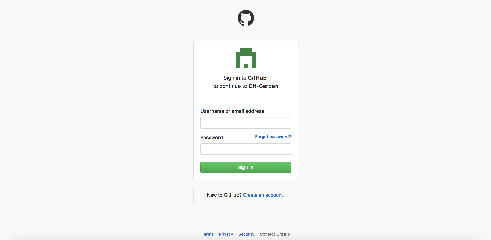
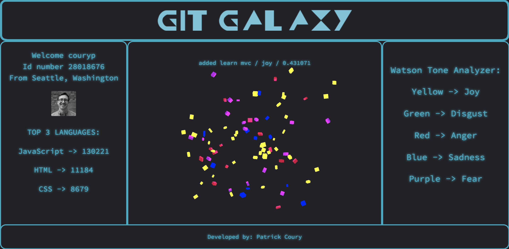

# Git Galaxy

Git Galaxy is a React browser application that visually represents a user's recent code on Github. After logging in with OAuth, Git Galaxy will retrieve commits from your most recently updated repositories. Then, these commits are piped through IBM's Watson Tone Analyzer and displayed on a three.js canvas. The purpose of Git Galaxy is twofold: first, to encourage better Git commit behavior; second, to display information in an exciting fashion. Developed in two weeks.

## Built With

* [ES6](http://es6-features.org/) - Javascript ES6
* [React](https://reactjs.org/) - React
* [three.js](https://github.com/mrdoob/three.js/) - three.js
* [OAuth](https://oauth.net/) - OAuth
* [Watson](https://www.ibm.com/watson/services/tone-analyzer/) - Watson Tone Analyzer
* [GitHub API](https://developer.github.com/v3/) - GitHub API
* [Node.js](https://nodejs.org/en/) - Node
* [PostgreSQL](https://www.postgresql.org/) - PostgreSQL

## Looking Forward

* More data interactivity
* Different representation of the data. Possibly with OBJ/MTL files
* Multi-galaxy view

## Developers

* **Patrick Coury** - [Patricks's GitHub](https://github.com/couryp)

## Links

* [https://github.com/couryp/GitGarden-Client](https://github.com/couryp/GitGarden-Client)
* [https://github.com/couryp/GitGarden-Server](https://github.com/couryp/GitGarden-Server)
* [http://hangul.surge.sh/](http://hangul.surge.sh/)

## Screenshots

## Splash Screen:

## GitHub OAuth:

## Explore Git Galaxy:

## Git Garden?

Originally, the plan was to create a garden with moveable obj/mtl files and represent data in the forms of trees and flowers within a grass canvas. This scene took too long to create something I was satisfied with and eventually I pivoted to a galaxy theme. I made this decision because rendering geometry was simpler to pick up. The Test.js component is evidence of this. Now, the repository name will remain as a reminder of this process.
